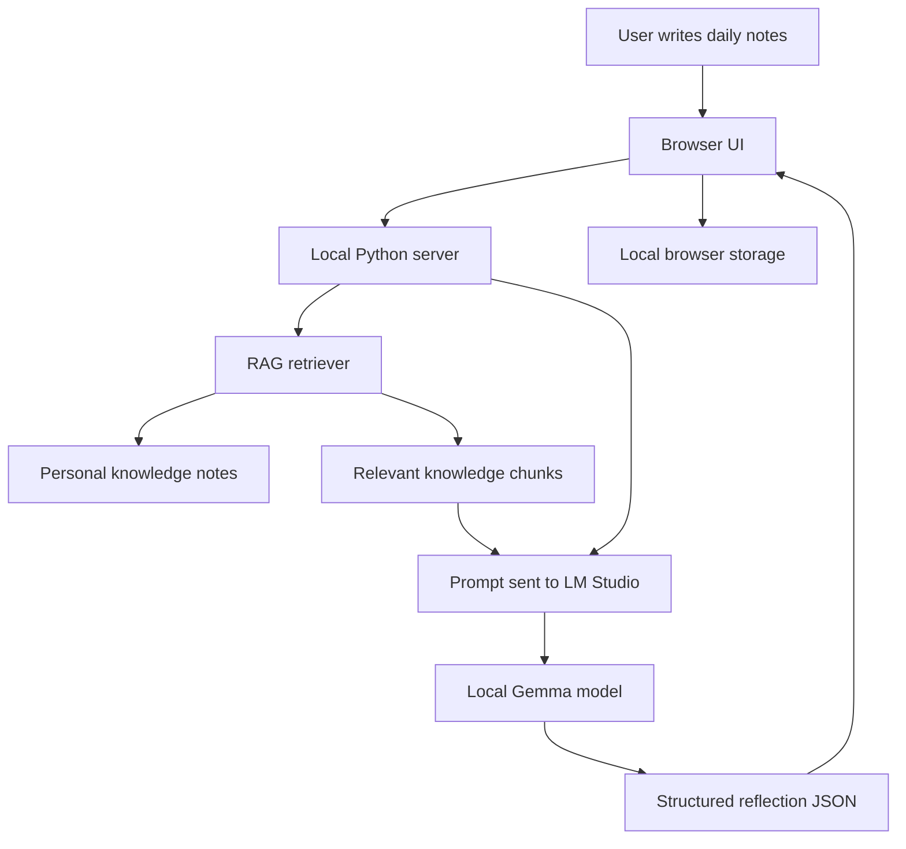
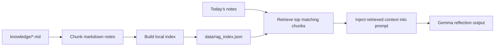

# Daily Reflection Agent

A local AI-powered reflection agent that turns messy daily activity notes into a calm, meaningful growth review.

It is tuned for:

- overall well-being
- fitness and energy
- AI career growth
- discipline and deep work
- mental strength
- communication
- confidence and consistency
- gratitude and Atomic Habits-style habit formation

## What It Does

The app helps you convert rough daily notes into:

- score for the day
- meaningful summary
- key pattern
- direct challenge
- habit cue
- tomorrow's promise
- saved reflection history
- yesterday's promise check
- weekly pattern review

It runs locally with LM Studio and can use your personal Markdown notes through a lightweight RAG layer.

## High-Level Flow



## RAG Flow

RAG means Retrieval-Augmented Generation. Instead of sending only today's notes to the model, the app first retrieves relevant context from your personal knowledge base.



Before RAG:

```text
Today's notes -> Gemma -> reflection
```

After RAG:

```text
Personal notes -> chunks -> retrieval index
Today's notes -> retrieve relevant personal context -> Gemma -> personalized reflection
```

This makes the app less generic. It can connect today's notes to your long-term themes, such as AI career growth, health discipline, comfort-zone patterns, and builder identity.

## Project Structure

```text
daily-reflection-agent/
  web/                       Browser UI
  data/reflections/          Saved Markdown reflections from the CLI
  knowledge/                 Private Markdown knowledge base for RAG
  scripts/                   Utility scripts
  evals/                     RAG retrieval evaluation cases
  examples/                  Sample daily notes
  ai-edge-skills/            Android AI Edge Gallery skill export
  server.py                  Local LM Studio bridge and web server
  rag.py                     Local retrieval layer
  daily_reflection_agent.py  Optional CLI reflection agent
  README.md
```

## Personal Knowledge RAG

Add Markdown notes under:

```text
knowledge/
```

Build the local retrieval index:

```powershell
python .\scripts\index_knowledge.py
```

This creates:

```text
data/rag_index.json
```

`data/rag_index.json` is generated and ignored by git.

To inspect retrieval directly:

```powershell
python .\scripts\query_knowledge.py "I avoided AI building and need a small habit cue"
```

## RAG Evaluation

RAG should be measured, not trusted blindly. This project includes a small retrieval evaluation harness:

```text
evals/rag_eval_cases.json
scripts/evaluate_rag.py
```

Each eval case contains:

- a realistic query
- expected knowledge headings that should appear in the top retrieved chunks

Run the baseline eval:

```powershell
python .\scripts\evaluate_rag.py
```

Example output:

```text
[PASS] ai_builder_avoidance
Retrieved:
  * 1. Career strengths
    2. Core Patterns
  * 3. Notes for Another Agent

Summary
Passed: 6/6
Hit rate: 100.0%
```

This helps answer:

- Did retrieval find the right personal knowledge?
- Which chunk ranked first?
- Did irrelevant chunks appear?
- Is the retriever ready to be replaced with vector search?

When the app uses retrieved knowledge, the UI status shows:

```text
Local AI + RAG
```

## RAG Debug Mode

The main UI stays calm by default. To inspect retrieval, enable:

```text
Show RAG debug after reflection
```

When enabled, the app shows a `Knowledge used` panel after reflection with:

- source file
- heading
- retrieval score
- short excerpt

This helps debug whether RAG is pulling the right context before the answer is generated.

## Run With Local AI

1. Open LM Studio.
2. Load your Gemma model.
3. Start LM Studio's local server. The default endpoint should be:

```text
http://127.0.0.1:1234
```

4. In this project folder, run:

```powershell
python server.py
```

5. Open:

```text
http://127.0.0.1:8765
```

Your notes stay on your laptop. The UI sends them only to your local LM Studio server.

## Offline UI

Open:

```text
web/index.html
```

Opening the file directly runs the simpler rule-based fallback without LM Studio. It keeps your draft and saved reflections in browser local storage.

## Optional CLI

Interactive mode:

```powershell
python daily_reflection_agent.py
```

From quick text:

```powershell
python daily_reflection_agent.py --text "Watched 1 hour AI podcast. Completed daily tasks. Felt stuck in comfort zone. Want to build AI agents."
```

From a notes file:

```powershell
python daily_reflection_agent.py --file examples/today_sample.txt
```

Each CLI run prints a concise reflection and saves a Markdown file under:

```text
data/reflections/
```

## Suggested Daily Input

Write rough points from your mobile. Messy is fine.

```text
- Watched 1 hour AI podcast
- Completed daily tasks
- Felt like I did not accomplish enough
- Want to build AI agents instead of watching more videos
- Did not exercise
- Felt grateful for having a holiday
```

## What Is Stored

The browser stores:

- `draftNotes`
- `reflectionHistory`
- `promiseStatus`
- `reflectionCache`

This is local to the browser profile for:

```text
http://127.0.0.1:8765
```

The repository ignores private/generated files:

- `knowledge/*.md`
- `data/reflections/`
- `data/rag_index.json`
- `.env`

## Learning Path

This project currently teaches:

- local LLM integration with LM Studio
- prompt engineering with structured JSON output
- browser UI and localStorage memory
- RAG fundamentals: ingest, chunk, index, retrieve, augment, generate
- promise tracking and weekly pattern analysis

Next natural upgrade:

```text
Replace keyword retrieval with Chroma + embeddings.
```
