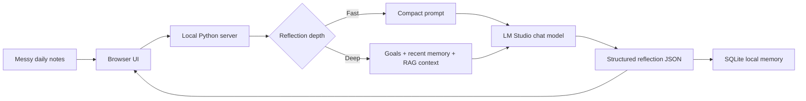
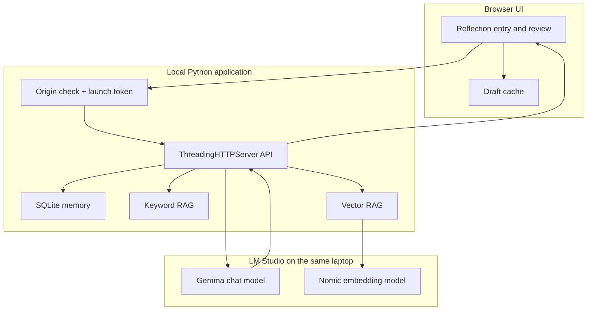
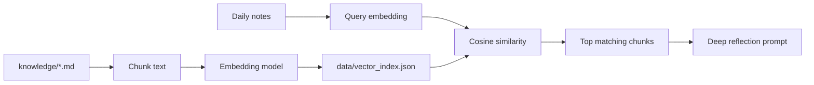

# Daily Reflection Agent

A privacy-first local AI reflection assistant that turns rough daily notes into a calm, structured growth review. It combines local LLM inference, retrieval-augmented generation (RAG), SQLite memory, lightweight analytics, and a browser UI without sending personal notes to a cloud API.

This is a portfolio prototype and learning lab, not a production mental-health product.

## Why It Exists

Daily journaling often fails because it asks for too much effort and gives too little value back. This app accepts messy bullet points and returns one focused reflection:

- a transparent daily score and reason
- a concise summary and recurring pattern
- one direct challenge
- one small promise for tomorrow
- optional Socratic follow-up actions

The design goal is simple: help a user move from passive self-improvement content toward small, visible actions.

## Demo Flow

1. Write rough daily notes in the browser.
2. Choose `Fast` for a short daily reflection or `Deep` for personalized context.
3. Click `Reflect`.
4. Review the score, pattern, challenge, and tomorrow promise.
5. Optionally open Review Mode for a tiny-step breakdown or a direct challenge.
6. Revisit saved reflections through History and Insights.



## What It Demonstrates

| Area | Implementation |
| --- | --- |
| Local AI integration | OpenAI-compatible LM Studio endpoints with automatic chat-model selection |
| Structured outputs | JSON schema constrained reflection, weekly-review, and follow-up responses |
| Context engineering | Separate Fast and Deep paths with bounded prompt context |
| RAG | Keyword retrieval and semantic vector retrieval over private Markdown notes |
| Evaluation | Repeatable retrieval eval harness with expected-heading checks |
| Memory | SQLite persistence for reflections, goals, promise status, and behavior signals |
| UX | Calm responsive browser UI, auto-save, loading skeletons, history, insights, and Review Mode |
| Privacy | Localhost binding, generated per-launch API token, origin checks, local export, and local delete |
| Mobile experiment | Importable Google AI Edge Gallery skill under `ai-edge-skills/` |

## Architecture



For a deeper walkthrough, see [docs/ARCHITECTURE.md](docs/ARCHITECTURE.md).

## Fast vs Deep Reflection

| Mode | Uses RAG | Uses goals and recent history | Best for |
| --- | --- | --- | --- |
| Fast | No | No | Short daily logging |
| Deep | Yes | Yes | Weekly reset or a difficult day |

Measured locally with `google/gemma-4-e4b`:

| Path | Total time |
| --- | ---: |
| Earlier unbounded reflection | 162.24 s |
| Fast mode | 39.91 s |
| Deep mode with vector RAG | 90.31 s |

The dominant latency is local model generation, not retrieval. Exact timings depend on laptop hardware and LM Studio model settings.

## RAG: What Changes

Without RAG:

```text
today's notes -> local chat model -> reflection
```

With Deep-mode RAG:

```text
private knowledge notes -> chunks -> local index
today's notes -> retrieve relevant chunks -> local chat model -> personalized reflection
```

The project includes two retrieval modes:

| Retriever | How it works | Tradeoff |
| --- | --- | --- |
| Keyword RAG | Scores overlapping terms and headings | Fast and transparent, but literal |
| Vector RAG | Embeds the query and ranks chunks by cosine similarity | Better semantic matching, but needs an embedding model |

### Vector RAG Flow



The saved index contains knowledge-chunk vectors. During a reflection, the app embeds only the new query and compares it with the saved vectors.

## Run Locally

### Prerequisites

- Python 3.11+
- [LM Studio](https://lmstudio.ai/)
- one loaded chat model, such as `google/gemma-4-e4b`
- optional embedding model for Vector RAG, such as `text-embedding-nomic-embed-text-v1.5`

### Start

1. Start the LM Studio local server at `http://127.0.0.1:1234`.
2. From this folder, run:

```powershell
.\scripts\start.ps1
```

3. Open `http://127.0.0.1:8765`.

You can also run `python .\server.py` directly.

### Offline Fallback

Open `web/index.html` directly to use a simpler rule-based fallback. It keeps draft and reflection data in browser local storage.

## Add Private Knowledge

Private notes belong under:

```text
knowledge/
```

Start from the sanitized example:

```powershell
Copy-Item .\examples\sample_growth_profile.md .\knowledge\personal_growth_notes.md
```

Build the indexes:

```powershell
python .\scripts\index_knowledge.py
python .\scripts\index_knowledge_vectors.py
```

Generated indexes and private notes are ignored by Git.

## Inspect and Evaluate Retrieval

Query each retriever directly:

```powershell
python .\scripts\query_knowledge.py "I consumed AI content but avoided building"
python .\scripts\query_vector_knowledge.py "I consumed AI content but avoided building"
```

Run the repeatable eval suite:

```powershell
python .\scripts\evaluate_rag.py --mode keyword
python .\scripts\evaluate_rag.py --mode vector
```

The browser also has an optional Deep-mode RAG debug panel showing source, heading, score, and excerpt. Debug mode stays hidden during normal journaling so the main flow remains calm.

## Local Privacy Boundary

Personal reflections may include sensitive emotional, career, or health-adjacent notes. This prototype keeps them local:

- the server binds to `127.0.0.1`
- the UI receives a random per-launch session token
- API requests must send `X-Reflection-Agent-Token`
- API requests with foreign `Origin` headers are rejected
- reflections are stored in `data/reflection_agent.db`
- private notes, generated indexes, databases, logs, and `.env` files are ignored by Git
- the Privacy tab can export or delete local app memory

Before making the repository public, run:

```powershell
git check-ignore -v .\knowledge\personal_growth_notes.md .\data\reflection_agent.db .\data\rag_index.json .\data\vector_index.json
```

## Project Structure

```text
daily-reflection-agent/
  ai-edge-skills/             Android AI Edge Gallery skill experiment
  docs/                       Architecture, decisions, and demo guide
  evals/                      Retrieval evaluation cases
  examples/                   Sanitized public examples
  knowledge/                  Private Markdown notes, ignored by Git
  scripts/                    Start, indexing, querying, and eval utilities
  tests/                      Focused automated tests
  web/                        Browser UI
  app_storage.py              SQLite local memory and analytics
  rag.py                      Keyword RAG
  vector_rag.py               Vector RAG with local embeddings
  server.py                   Local web server and LM Studio bridge
```

## Tests

Run the local checks:

```powershell
python -m unittest discover -s .\tests -v
python -m py_compile .\server.py .\app_storage.py .\rag.py .\vector_rag.py
node --check .\web\app.js
```

Vector evals require the embedding model to be loaded in LM Studio.

## Design Decisions and Limits

This project intentionally favors a small local stack:

- SQLite is enough for a single-user laptop workflow.
- A custom Python standard-library server keeps setup simple.
- Bounded Deep-mode context controls prompt size.
- Fast mode avoids RAG and history when speed matters more than personalization.
- The UI presents one primary reflection instead of overwhelming the user with many mapped growth categories.

Known limits:

- local model speed depends heavily on hardware
- the backend uses blocking HTTP calls and is not a production multi-user service
- indexes are rebuilt manually when knowledge files change
- vector search is an in-memory cosine scan, suitable for a personal knowledge base
- fallback coaching is intentionally simpler than local LLM output

For production, the next steps would be FastAPI with async HTTP calls, encrypted storage, incremental vector indexing, stronger rate limiting, and a deployment-specific authentication model.

## Portfolio Positioning

This project is a focused secondary portfolio artifact. It demonstrates the path from a personal problem to an end-to-end local AI product:

```text
idea -> UX -> local model integration -> structured output -> RAG -> evals
     -> memory -> security hardening -> latency tradeoffs -> documentation
```

The flagship capstone in this repository is the domain-specific Ops Intelligence Agent. DRA remains intentionally frozen after this portfolio wrap-up so future learning can compound inside that larger CloudOps and AIOps project.

## Demo

Use [docs/DEMO.md](docs/DEMO.md) for a short recruiter walkthrough.
