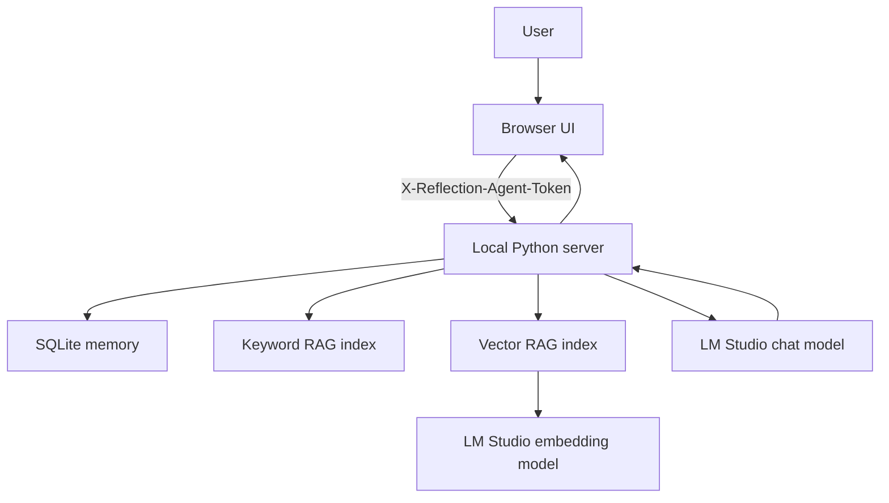
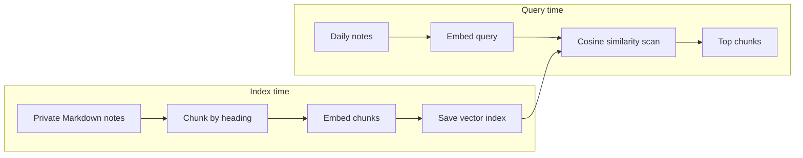

# Daily Reflection Agent Architecture

## System Boundary

Daily Reflection Agent is a single-user, local-first prototype. The browser UI, Python server, SQLite database, LM Studio chat model, and optional embedding model all run on the user's laptop.



## Request Paths

### Fast Reflection

Fast mode is optimized for frequent daily use.

```text
notes + previous promise -> compact prompt -> chat model -> JSON -> auto-save
```

It intentionally skips goals, recent reflection history, and RAG retrieval.

### Deep Reflection

Deep mode spends additional time to retrieve and inject bounded context.

```text
notes
  -> retrieve relevant private knowledge
  -> add active goals
  -> add recent reflection history
  -> add previous promise
  -> structured prompt
  -> chat model
  -> JSON
  -> auto-save
```

## RAG Pipeline

### Keyword RAG

`rag.py` chunks Markdown notes by heading and ranks chunks with a lightweight TF-IDF-style score plus small domain boosts. This mode is quick, inspectable, and works without an embedding model.

### Vector RAG

`vector_rag.py` calls LM Studio's embeddings endpoint. Knowledge chunks are embedded at index time and saved locally. At query time, only the new reflection notes are embedded. Cosine similarity ranks the stored chunks.



## Structured AI Outputs

The server asks LM Studio for JSON-schema constrained responses. Three schemas keep the frontend predictable:

| Schema | Purpose |
| --- | --- |
| Daily reflection | score, summary, pattern, challenge, promise, behavior signals |
| Weekly review | repeated patterns, builder signal, comfort-zone signal, experiment |
| Follow-up | one Socratic answer and one tiny next step |

The parser also has repair fallbacks because smaller local models occasionally return JSON-like output.

## Memory

SQLite stores durable local state:

| Table | Purpose |
| --- | --- |
| `reflections` | notes, generated reflection, model metadata, RAG debug data, behavior signals |
| `promise_status` | whether the user kept or missed a previous promise |
| `goals` | active growth goals used by Deep mode |

The browser also stores draft text and a small reflection cache for responsiveness.

## Local Security Controls

The local server is not publicly exposed. It binds to `127.0.0.1` and injects a random launch token into the served page. Browser API calls include the token in `X-Reflection-Agent-Token`. API requests with a foreign `Origin` header are rejected.

This reduces accidental cross-origin access while keeping local setup small. It is not a replacement for production authentication.

## Tradeoffs

| Decision | Benefit | Cost |
| --- | --- | --- |
| LM Studio local models | Private notes stay on the laptop | Generation latency depends on hardware |
| SQLite | Simple durable single-user memory | Not designed for a hosted multi-user service |
| Standard-library HTTP server | Zero extra backend dependencies | Blocking LM Studio calls and limited production ergonomics |
| Manual vector indexing | Easy to understand while learning | Knowledge changes require index rebuild |
| In-memory cosine scan | Transparent and sufficient for small notes | Not suitable for a large knowledge base |

## Production Evolution

A production version would replace the local HTTP server with FastAPI and async model calls, add encrypted storage and explicit user authentication, update embeddings incrementally with content hashes, and move background work behind a queue.
